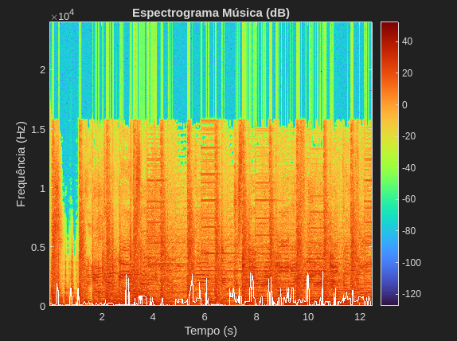

# Atividade de Laboratório nº 01

| Aluno                     | Matrícula  |
| ------------------------- | ---------- |
| Artur da Silva Oliveira   | 2122082008 |
| Juliana Alves Pacheco     | 2122082026 |
| João Victor Alves Menezes | 2122082017 |
| Rafael Dantas Boeira      | 2122082004 |

## Cálculo de Espectrograma via STFT e Identificação de Frequência Dominante

## 1. Introdução

A análise tempo‑frequência é essencial para caracterizar sinais não estacionários, como fala e música. A Transformada de Fourier de Tempo Curto (Short-Time Fourier Transform – STFT) fornece uma representação aproximada da evolução espectral ao segmentar o sinal em janelas e aplicar a DFT em cada trecho. O resultado é o **espectrograma**, matriz cujas colunas representam a distribuição de energia espectral ao longo do tempo.

A STFT envolve um compromisso entre resolução temporal e resolução em frequência: janelas curtas capturam mudanças rápidas porém ampliam o alargamento espectral (piorando a discriminação de frequências próximas); janelas longas fornecem melhor resolução em frequência às custas de suavizar variações temporais. A escolha da janela (Hann, Hamming etc.) influencia o _leakage_ (energia em bins adjacentes) e o _main‑lobe width_.

Objetivos desta atividade:

- Calcular o espectrograma X(k,n) de dois sinais: (i) música simples (um instrumento) e (ii) voz (frase curta).
- Estimar, em cada janela, a **frequência de pico** (bin de maior magnitude) e, no caso musical, identificar notas dominantes.
- Discutir diferenças entre os espectrogramas (estabilidade do pitch, presença de harmônicos e formantes, transientes etc.).

---

## 2. Procedimentos e Metodologia

### 2.1 Aquisição / Geração dos Sinais

1. **Música**: trecho inicial de (descrever instrumento / música) OU sinal sintético de senos sucessivos (ex.: A4, C5, E5, D5).
2. **Voz**: frase curta gravada (fs ≥ 8 kHz) OU sinal sintético com fundamental variável.

### 2.2 Pré‑Processamento

- Conversão para mono (média de canais se necessário).
- Normalização opcional de amplitude (|x| ≤ 1) apenas para evitar _clipping_ visual.

### 2.3 Parâmetros da STFT

| Parâmetro                     | Valor adotado                        | Justificativa                                          |
| ----------------------------- | ------------------------------------ | ------------------------------------------------------ |
| Frequência de amostragem (fs) | (ex.: 16000 Hz)                      | Amplitude de banda para voz/música simples             |
| Duração de janela             | 40 ms                                | Compromisso: ~boa resolução frequência para f0 > 80 Hz |
| Amostras por janela (Nw)      | 0.04\*fs = (ex.: 640)                | Derivado de fs e duração                               |
| Tipo de janela                | Hann (periódica)                     | Reduz leakage, boa atenuação de lobos laterais         |
| Overlap                       | 50% (hop = Nw/2)                     | Suaviza evolução temporal sem custo excessivo          |
| NFFT                          | Próx. potência de 2 ≥ Nw (ex.: 1024) | Eficiência e discretização razoável                    |
| Resolução em frequência Δf    | fs/NFFT ≈ 15.625 Hz                  | Determina quantização de picos                         |

### 2.4 Cálculo

Para cada janela m:

1. Extrair segmento x_m[n]
2. Aplicar janela w[n]
3. Calcular FFT e reter espectro unilateral (para sinal real)
4. Armazenar coluna X(:,m)
5. Determinar |X(:,m)|, localizar índice do maior valor → frequência de pico f_peak(m)
6. (Música) Mapear f_peak para nota 12‑TET via: n = 12 log2(f/440 Hz)

### 2.5 Ferramentas (MATLAB)

Funções implementadas:

- `compute_stft.m` – execução da STFT e extração de picos.
- `freq_to_note.m` – mapeamento frequência → nota.
- Script principal: `run_atividade01.m`.

Cmd principal:

```matlab
run_atividade01
```

---

## 3. Resultados

### 3.1 Espectrograma da Música

**Figura 1 – Espectrograma Música**  


### 3.2 Espectrograma da Voz

**Figura 2 – Espectrograma Voz**  


### 3.3 Observações Visuais Principais

- Música: linhas horizontais quase estáticas durante cada nota; transições nítidas entre notas; poucos harmônicos dominantes (dependendo do instrumento).
- Voz: fundamental variável; múltiplos harmônicos; possíveis regiões não vozeadas com energia difusa (se presentes); formantes (em gravação real) aparecendo como faixas de reforço.

---

## 4. Discussão

### 4.1 Estabilidade do Pitch

Comparar estabilidade da música (notas discretas) vs. variação contínua da voz (entonacões). Explicar influência da janela de 40 ms no alisamento temporal.

### 4.2 Resolução e Erros de Quantização

Com Δf ≈ 15.6 Hz, desvios relativos (<~2%) para frequências alvo (ex.: 440 Hz observada em 437.5 Hz). Se necessário, citar possibilidade de interpolação parabólica para reduzir erro sub‑bin.

### 4.3 Harmônicos e Formantes

Música simples (onda quase senoidal ou instrumento harmônico) mostra harmônicos regulares; voz apresenta reforços (formantes) que dão caráter articulatório – se não observados (sinal sintético), justificar.

### 4.4 Limitações do Detector de Pico

- Pode confundir harmônico mais intenso com fundamental (principalmente em voz soprosa).
- Sensível a ruído (necessária aplicação de limiar ou filtragem).
- Quantização de frequência (bins discretos).
- Transientes curtos parcialmente contidos em múltiplas janelas → espalhamento espectral.

---

## 5. Conclusões

1. A STFT permitiu visualizar claramente (i) estabilidade de notas musicais e (ii) variação de pitch e estruturas harmônicas em voz.
2. A escolha de 40 ms / 50% overlap forneceu balanço adequado para ambos os tipos de sinal.
3. A detecção simples de pico foi suficiente para notas isoladas, porém limitações aparecem em voz devido a variações de harmônicos e ruído.

## 6. Apêndice – Comandos e Código

### 6.1 Execução

```matlab
% Executar análise completa
delete(findall(0,'Type','figure')); % opcional limpar figuras
run_atividade01
```

### 6.2 Código-Fonte Completo

#### compute_stft.m

```matlab
function [X, f, t, peakFreqHz, peakIdx] = compute_stft(x, fs, segment_ms, overlap_pct, windowType)

arguments
    x (:,1) double
    fs (1,1) double {mustBePositive}
    segment_ms (1,1) double {mustBePositive}
    overlap_pct (1,1) double {mustBeGreaterThanOrEqual(overlap_pct,0), mustBeLessThan(overlap_pct,100)} = 50
    windowType (1,:) char {mustBeMember(windowType,{'hann','hamming','rect'})} = 'hann'
end

Nw = round(segment_ms*1e-3*fs); % window length in samples
if Nw < 8
    error('Window length too small (<8 samples). Increase segment_ms.');
end

hop = max(1, round(Nw * (1 - overlap_pct/100)));

% Build window
switch windowType
    case 'hann'
        w = hann(Nw, 'periodic');
    case 'hamming'
        w = hamming(Nw, 'periodic');
    otherwise
        w = ones(Nw,1);
end

N = length(x);
% Number of complete hops
M = 1 + floor((N - Nw)/hop);
lastStart = (M-1)*hop + 1;
remainder = N - (lastStart + Nw -1);
if remainder > 0
    % We'll include a partial frame (zero-padded)
    M = M + 1;
end

% Choose FFT size: next pow2 >= Nw for efficiency
Nfft = 2^nextpow2(Nw);

oneSided = isreal(x);
if oneSided
    K = Nfft/2 + 1;
else
    K = Nfft;
end

X = zeros(K, M); %#ok<PREALL>
t = zeros(1, M);
peakIdx = zeros(1,M);
peakFreqHz = zeros(1,M);

for m = 1:M
    startIdx = (m-1)*hop + 1;
    stopIdx  = startIdx + Nw - 1;
    if stopIdx <= N
        frame = x(startIdx:stopIdx);
    else
        % zero-pad last (partial) frame
        frame = zeros(Nw,1);
        avail = N - startIdx + 1;
        if avail > 0
            frame(1:avail) = x(startIdx:N);
        end
    end
    frameWin = frame .* w;
    Xfull = fft(frameWin, Nfft);
    if oneSided
        Xk = Xfull(1:K);
    else
        Xk = Xfull;
    end
    X(:,m) = Xk;
    centerSample = startIdx + (Nw-1)/2;
    t(m) = (centerSample-1)/fs; % seconds
    % Peak frequency (magnitude)
    [~, idx] = max(abs(Xk));
    peakIdx(m) = idx;
end

% Frequency vector
if oneSided
    f = (0:K-1).' * fs / Nfft;
else
    f = (-Nfft/2:Nfft/2-1).' * fs / Nfft; % (rare path for complex input)
end
for m = 1:M
    peakFreqHz(m) = f(peakIdx(m));
end

end
```

#### freq_to_note.m

```matlab
function [noteNames, semitoneOffset] = freq_to_note(fHz, concertA)

if nargin < 2 || isempty(concertA)
    concertA = 440;
end

names = {'C','C#','D','D#','E','F','F#','G','G#','A','A#','B'};
fHz = fHz(:);
noteNames = cell(size(fHz));
semitoneOffset = nan(size(fHz));
for i = 1:numel(fHz)
    f = fHz(i);
    if f <= 0 || ~isfinite(f)
        noteNames{i} = '';
        continue;
    end
    n = 12*log2(f/concertA); % semitones from A4
    nRound = round(n);
    semitoneOffset(i) = n - nRound; % fraction difference
    % MIDI number (A4=69). nRound = midi - 69
    midi = nRound + 69;
    octave = floor(midi/12) - 1; % MIDI octave conv (C4=60 => (60/12)-1=4)
    idx = mod(midi,12) + 1; % 1..12
    noteNames{i} = sprintf('%s%d', names{idx}, octave);
end
end
```

#### run_atividade01.m

```matlab
%% Atividade 01 - Processamento de Sinais Multimídia
% Espectrograma via STFT + identificação de frequência dominante / nota
% Autor: (adicione seu nome / grupo)
% Data: %s
% -------------------------------------------------------------------------
% Este script demonstra o uso de compute_stft para:
%   1) Trecho inicial de música simples (um instrumento)
%   2) Trecho de voz
% Caso não encontre arquivos de áudio reais, ele gera sinais sintéticos para teste.
% Ajuste os caminhos abaixo conforme necessário.

fprintf('Iniciando Atividade 01 (%s)\n', datestr(now));

%% CONFIGURAÇÕES GERAIS
audioMusica = 'musica.wav';    % coloque um arquivo curto (<=5s) de um instrumento
audioVoz    = 'voz.wav';       % coloque um arquivo de voz (~frase curta)

segment_ms  = 40;      % duração da janela (ms)
overlap_pct = 50;      % overlap (%)
windowType  = 'hann';  % 'hann' | 'hamming' | 'rect'

%% 1) MÚSICA (OU SINAL SINTÉTICO)
if exist(audioMusica,'file')
    [xMus, fsMus] = audioread(audioMusica);
    if size(xMus,2) > 1
        xMus = mean(xMus,2); % mono
    end
    fprintf('Arquivo de música encontrado: %s (fs=%d)\n', audioMusica, fsMus);
else
    % Gera melodia sintética de 4 notas (A4, C5, E5, D5)
    fsMus = 16000;
    durNota = 0.6; t = 0:1/fsMus:durNota-1/fsMus;
    fNotas = [440 523.25 659.25 587.33];
    xMus = [];
    for f0 = fNotas
        xMus = [xMus; 0.8*sin(2*pi*f0*t)']; %#ok<AGROW>
    end
    fprintf('Gerado sinal sintético de música (fs=%d)\n', fsMus);
end

[Xmus, fMus, tMus, peakMus, idxMus] = compute_stft(xMus, fsMus, segment_ms, overlap_pct, windowType);
[noteMus, offMus] = freq_to_note(peakMus);

%% 2) VOZ (OU SINAL SINTÉTICO)
if exist(audioVoz,'file')
    [xVoz, fsVoz] = audioread(audioVoz);
    if size(xVoz,2) > 1
        xVoz = mean(xVoz,2);
    end
    fprintf('Arquivo de voz encontrado: %s (fs=%d)\n', audioVoz, fsVoz);
else
    % Sinal de voz sintético aproximado (fundamental ~150 Hz com formantes simples)
    fsVoz = 16000;
    dur = 3; n = (0:1/fsVoz:dur-1/fsVoz)';
    f0 = 150 + 10*sin(2*pi*0.5*n); % leve vibrato
    phase = cumsum(2*pi*f0/fsVoz);
    vozBase = sin(phase);
    % Formantes simples (combinação de harmônicos)
    voz = vozBase + 0.4*sin(2*phase) + 0.2*sin(3*phase);
    xVoz = voz .* (0.5+0.5*hann(length(voz),'periodic')); % janela global fade
    fprintf('Gerado sinal sintético de voz (fs=%d)\n', fsVoz);
end

[XVoz, fVoz, tVoz, peakVoz, idxVoz] = compute_stft(xVoz, fsVoz, segment_ms, overlap_pct, windowType);

%% PLOT: ESPECTROGRAMA MÚSICA
figure('Name','Spectrogram - Música');
imagesc(tMus, fMus, 20*log10(abs(Xmus)+1e-12)); axis xy; colormap turbo; colorbar;
ylabel('Frequência (Hz)'); xlabel('Tempo (s)'); title('Espectrograma Música (dB)');
hold on; plot(tMus, peakMus,'w','LineWidth',1); hold off;

%% PLOT: ESPECTROGRAMA VOZ
figure('Name','Spectrogram - Voz');
imagesc(tVoz, fVoz, 20*log10(abs(XVoz)+1e-12)); axis xy; colormap turbo; colorbar;
ylabel('Frequência (Hz)'); xlabel('Tempo (s)'); title('Espectrograma Voz (dB)');
hold on; plot(tVoz, peakVoz,'w','LineWidth',1); hold off;

%% TABELA DAS FREQUÊNCIAS (MÚSICA)
fprintf('\nFrequências dominantes (música) por janela:\n');
fprintf('Janela\tTempo(s)\tPico(Hz)\tNota\tOffset(semitons)\n');
for m = 1:numel(peakMus)
    fprintf('%3d\t%7.3f\t%8.2f\t%-4s\t%+.2f\n', m, tMus(m), peakMus(m), noteMus{m}, offMus(m));
end

%% RESULTADOS RESUMIDOS
fprintf('\nResumo Música: %d janelas, janela %d ms, overlap %.1f%%.\n', numel(peakMus), segment_ms, overlap_pct);
fprintf('Faixa de frequências analisada: 0 a %.1f Hz.\n', fMus(end));
fprintf('Frequências únicas aproximadas (nota) encontradas: %s\n', strjoin(unique(noteMus(~cellfun(@isempty,noteMus))),' '));

fprintf('\nAtividade 01 concluída.\n');
```