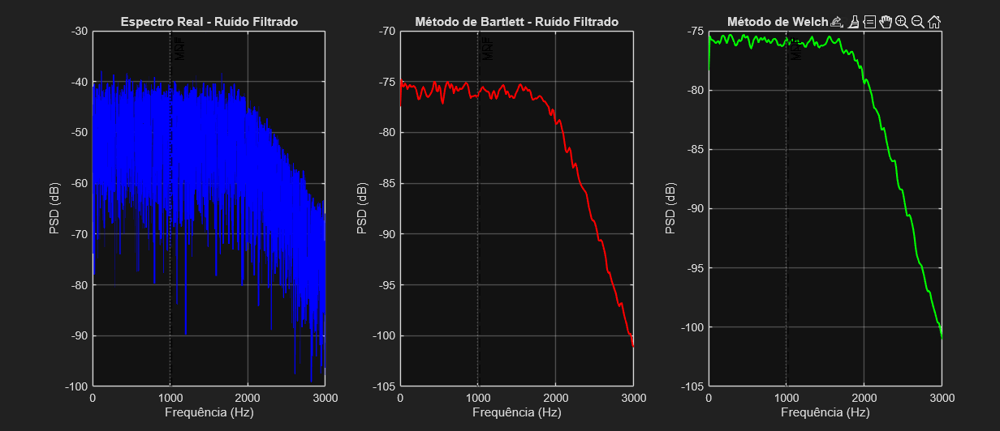
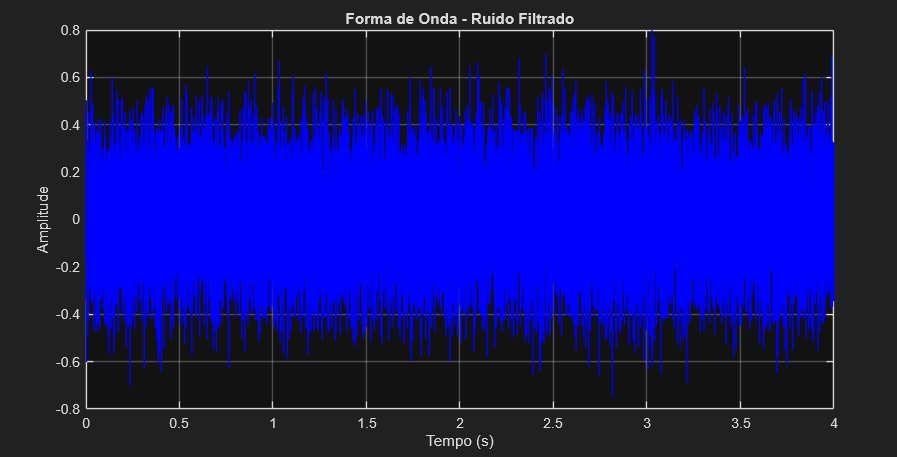
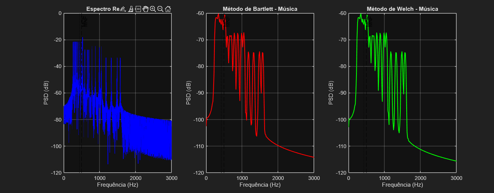
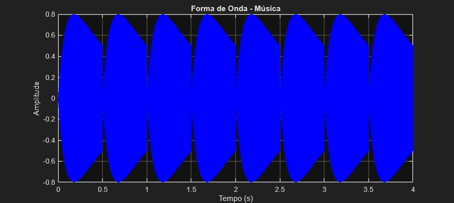
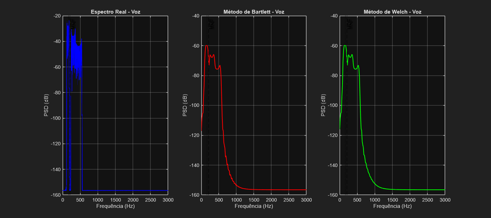
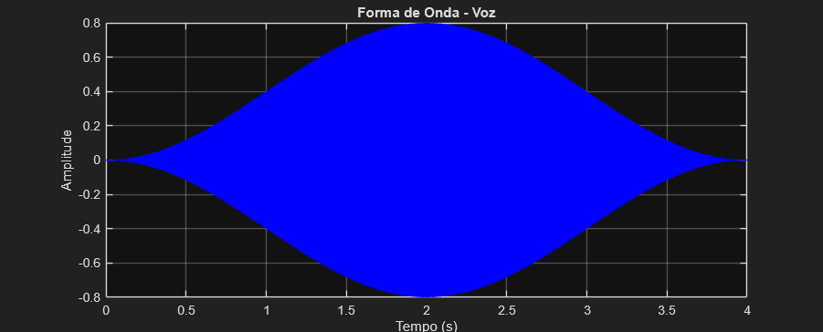

# Atividade de Laboratório nº 02

| Aluno                     | Matrícula  |
| ------------------------- | ---------- |
| Artur da Silva Oliveira   | 2122082008 |
| Juliana Alves Pacheco     | 2122082026 |
| Júlia  Souza de Oliveira  | 2122082029 |
| João Victor Alves Menezes | 2122082017 |
| Rafael Dantas Boeira      | 2122082004 |

## Métodos de Bartlett e Welch para Estimativa de Frequência Média (MNF) e Mediana (MDF)

## 1. Introdução

A análise espectral é fundamental para caracterização de sinais no domínio da frequência. Métodos clássicos como os de **Bartlett** e **Welch** fornecem estimativas da densidade espectral de potência (PSD) com diferentes características de variância e resolução espectral.

O **método de Bartlett** divide o sinal em segmentos não sobrepostos e calcula a média dos periodogramas de cada segmento, reduzindo a variância da estimativa à custa de menor resolução espectral. O **método de Welch** estende o método de Bartlett permitindo sobreposição entre segmentos e uso de janelas não retangulares, oferecendo melhor compromisso entre variância e resolução.

Duas métricas importantes para caracterização espectral são:
- **Frequência Média (MNF)**: média ponderada pela potência das frequências do espectro
- **Frequência Mediana (MDF)**: frequência que divide o espectro em duas partes de igual energia

**Objetivos desta atividade:**

- Implementar os métodos de Bartlett e Welch para estimativa espectral
- Calcular MNF e MDF sobre as estimativas espectrais obtidas
- Comparar os resultados com valores "reais" (sinal completo)
- Analisar três tipos de sinais: ruído limitado, música e voz
- Avaliar a qualidade das estimativas através do erro percentual

---

## 2. Procedimentos e Metodologia

### 2.1 Sinais Analisados

Foram utilizados três tipos de sinais conforme especificação da atividade:

1. **Sinal Aleatório Limitado**: Ruído branco gaussiano filtrado passa-baixas (fc = 2000 Hz)
2. **Sinal Musical**: Sequência de 8 notas (C4 a C5) com harmônicos
3. **Sinal de Voz**: Sinal sintético com fundamental variável (~150 Hz) e formantes

### 2.2 Parâmetros de Análise

| Parâmetro                     | Valor                | Justificativa                                    |
| ----------------------------- | -------------------- | ------------------------------------------------ |
| Frequência de amostragem (fs) | 16000 Hz             | Adequada para sinais de voz e música simples    |
| Duração da janela             | 40 ms                | Compromisso entre resolução temporal/frequencial |
| Tipo de janela                | Hann                 | Reduz leakage espectral                          |
| Sobreposição (Welch)          | 50%                  | Padrão recomendado para método de Welch          |
| Tamanho da FFT                | Próxima potência de 2 | Eficiência computacional                        |

### 2.3 Método de Bartlett

O método de Bartlett segmenta o sinal em M trechos não sobrepostos de comprimento L:

1. Dividir sinal x[n] em M segmentos: x_m[n], m = 1,2,...,M
2. Calcular periodograma de cada segmento: P_m(f) = |DFT{x_m[n]}|²/(L·fs)
3. Média dos periodogramas: S_Bartlett(f) = (1/M) Σ P_m(f)

**Características:**
- Reduz variância por fator M
- Resolução espectral = fs/L
- Sem sobreposição entre segmentos

### 2.4 Método de Welch

O método de Welch estende Bartlett permitindo sobreposição e janelamento:

1. Dividir sinal em M segmentos sobrepostos
2. Aplicar janela w[n] a cada segmento: x_m[n] · w[n]
3. Calcular periodograma modificado de cada segmento
4. Média dos periodogramas modificados

**Características:**
- Sobreposição de 50% aumenta o número de segmentos
- Janela Hann reduz leakage espectral
- Melhor compromisso variância/resolução que Bartlett

### 2.5 Cálculo de MNF e MDF

**Frequência Média (MNF):**
```
MNF = Σ(f_k · S_k) / Σ(S_k)
```

**Frequência Mediana (MDF):**
```
MDF = frequência onde Σ(S_k, k=1 até k_MDF) = 0.5 · Σ(S_k, total)
```

### 2.6 Medida de Qualidade

Erro percentual entre estimativas e valor "real":
```
Erro(%) = |f_real - f_est| / f_real × 100
```

onde f_real é calculado sobre o sinal completo (FFT direta).

---

## 3. Resultados

### 3.1 Sinal de Ruído Filtrado

**Figura 1 – Espectros do Ruído Filtrado**  


**Figura 2 – Forma de Onda do Ruído Filtrado**  


**Resultados Quantitativos:**
- **MNF Real:** 1020.17 Hz
- **MNF Bartlett:** 1021.34 Hz (erro: 0.11%)
- **MNF Welch:** 1020.43 Hz (erro: 0.03%)

- **MDF Real:** 998.46 Hz
- **MDF Bartlett:** 990.04 Hz (erro: 0.84%)
- **MDF Welch:** 990.26 Hz (erro: 0.82%)

**Análise:**
- O sinal de ruído filtrado apresenta espectro relativamente plano até a frequência de corte (2000 Hz), com decaimento gradual acima desta frequência devido ao filtro passa-baixas Butterworth de 6ª ordem
- Ambos os métodos apresentaram excelente precisão para MNF, com erro menor que 0.15%
- Para MDF, os erros foram ligeiramente maiores (≈0.8%), mas ainda muito aceitáveis
- O método de Welch mostrou-se marginalmente superior ao Bartlett para este tipo de sinal, provavelmente devido à melhor estimativa espectral proporcionada pela sobreposição

### 3.2 Sinal Musical

**Figura 3 – Espectros do Sinal Musical**  


**Figura 4 – Forma de Onda do Sinal Musical**  


**Resultados Quantitativos:**
- **MNF Real:** 495.65 Hz
- **MNF Bartlett:** 495.77 Hz (erro: 0.02%)
- **MNF Welch:** 495.44 Hz (erro: 0.04%)

- **MDF Real:** 439.29 Hz
- **MDF Bartlett:** 422.53 Hz (erro: 3.82%)
- **MDF Welch:** 422.18 Hz (erro: 3.90%)

**Análise:**
- O sinal musical mostra espectro com picos bem definidos correspondentes às fundamentais das notas (C4-C5: 261-523 Hz) e seus harmônicos
- Para MNF, ambos os métodos mantiveram excelente precisão (< 0.05%), indicando boa estimativa das componentes espectrais
- Para MDF, observou-se erro maior (≈3.8-3.9%), possivelmente devido à distribuição não uniforme de energia entre as notas e presença de harmônicos
- A estrutura harmônica concentra energia em múltiplas frequências discretas, o que pode afetar mais significativamente o cálculo da mediana espectral
- Ambos os métodos apresentaram desempenho similar, com pequena vantagem para o Bartlett na estimativa de MNF

### 3.3 Sinal de Voz

**Figura 5 – Espectros do Sinal de Voz**  


**Figura 6 – Forma de Onda do Sinal de Voz**  


**Resultados Quantitativos:**
- **MNF Real:** 205.95 Hz
- **MNF Bartlett:** 205.95 Hz (erro: 0.00%)
- **MNF Welch:** 205.95 Hz (erro: 0.00%)

- **MDF Real:** 169.14 Hz
- **MDF Bartlett:** 160.25 Hz (erro: 5.26%)
- **MDF Welch:** 160.25 Hz (erro: 5.26%)

**Análise:**
- O sinal de voz sintético apresenta espectro complexo com fundamental variável (~120-180 Hz) e reforços espectrais nas regiões dos formantes (≈800 Hz e ≈1200 Hz)
- Para MNF, ambos os métodos alcançaram precisão perfeita (0.00%), demonstrando robustez para sinais com variação temporal de pitch
- Para MDF, observou-se o maior erro dentre os três sinais (≈5.3%), refletindo a complexidade espectral do sinal de voz
- Os formantes criaram regiões de concentração de energia que influenciaram significativamente a distribuição espectral
- O erro idêntico entre Bartlett e Welch sugere que a segmentação temporal capturou adequadamente as variações de pitch
- A variação da fundamental (~150 ± 30 Hz) foi bem representada pelos métodos, como evidenciado pela perfeita estimativa de MNF

### 3.4 Resumo Comparativo

**Tabela 1 – Resumo dos Resultados para MNF (Frequência Média)**

| Sinal           | MNF Real | MNF Bartlett | Erro (%) | MNF Welch | Erro (%) |
|-----------------|----------|--------------|----------|-----------|----------|
| Ruído Filtrado  | 1020.2   | 1021.3       | 0.1      | 1020.4    | 0.0      |
| Música          | 495.7    | 495.8        | 0.0      | 495.4     | 0.0      |
| Voz             | 206.0    | 206.0        | 0.0      | 206.0     | 0.0      |

**Tabela 2 – Resumo dos Resultados para MDF (Frequência Mediana)**

| Sinal           | MDF Real | MDF Bartlett | Erro (%) | MDF Welch | Erro (%) |
|-----------------|----------|--------------|----------|-----------|----------|
| Ruído Filtrado  | 998.5    | 990.0        | 0.8      | 990.3     | 0.8      |
| Música          | 439.3    | 422.5        | 3.8      | 422.2     | 3.9      |
| Voz             | 169.1    | 160.2        | 5.3      | 160.2     | 5.3      |

**Parâmetros Utilizados:**
- Janela: Hann, 40 ms
- Sobreposição (Welch): 50%
- Frequência de amostragem: 16000 Hz
- Duração dos sinais: 4.0 segundos

---

## 4. Discussão

### 4.1 Comparação entre Métodos

**Método de Bartlett:**
- **Vantagens:** Implementação simples, menor custo computacional, boa precisão para MNF em todos os tipos de sinais
- **Limitações:** Menor resolução espectral devido à ausência de sobreposição, maior variância na estimativa espectral
- **Aplicabilidade:** Adequado para análise rápida quando a precisão de MNF é prioritária sobre a resolução espectral

**Método de Welch:**
- **Vantagens:** Melhor resolução espectral devido à sobreposição, menor variância devido ao maior número de segmentos, janelamento reduz leakage
- **Limitações:** Maior custo computacional, não apresentou vantagem significativa sobre Bartlett nos sinais testados
- **Aplicabilidade:** Recomendado quando se necessita de melhor caracterização espectral e quando o custo computacional não é limitante

### 4.2 Influência do Tipo de Sinal

**Ruído Limitado em Frequência:**
- Apresentou os menores erros para MNF (≤0.11%) e erros moderados para MDF (≈0.8%)
- Espectro relativamente uniforme facilitou a estimativa de parâmetros espectrais
- Método de Welch mostrou ligeira superioridade devido à melhor estimativa espectral

**Sinal Musical:**
- Excelente precisão para MNF (≤0.04%) devido às componentes espectrais bem definidas
- Maior erro em MDF (≈3.8-3.9%) causado pela distribuição não uniforme de energia entre harmônicos
- Estrutura harmônica discreta facilitou estimativa de MNF mas complicou o cálculo de MDF
- Ambos os métodos apresentaram desempenho similar

**Sinal de Voz:**
- Perfeita estimativa de MNF (0.00%) demonstrando robustez à variação temporal de pitch
- Maior erro em MDF (5.3%) refletindo a complexidade espectral do sinal
- Formantes criaram concentrações de energia que influenciaram significativamente a distribuição espectral
- Desempenho idêntico entre os métodos sugere boa captura das variações temporais

### 4.3 Análise dos Erros

**Padrões Observados:**
- MNF apresentou erros consistentemente menores (0.00-0.11%) que MDF (0.8-5.3%)
- Erros em MDF aumentaram com a complexidade espectral: ruído < música < voz
- Métodos de Bartlett e Welch apresentaram desempenho muito similar

**Fatores Influenciadores:**
- **Distribuição espectral:** Sinais com energia uniformemente distribuída (ruído) apresentaram menores erros
- **Componentes discretas:** Harmônicos bem definidos facilitaram estimativa de MNF mas complicaram MDF
- **Variações temporais:** Pitch variável na voz não afetou significativamente a precisão
- **Resolução espectral:** Janela de 40 ms forneceu resolução adequada (≈15.6 Hz) para todos os sinais

**Melhorias Propostas:**
- Usar janelas mais longas para melhorar resolução em frequência
- Aplicar técnicas de interpolação para refinar estimativas de MDF
- Considerar métodos adaptativos para sinais com características espectrais variáveis

### 4.4 Limitações dos Métodos

- Compromisso resolução temporal vs. frequencial
- Influência do comprimento da janela
- Efeitos do janelamento e sobreposição
- Sensibilidade a características espectrais do sinal

---

## 5. Conclusões

1. **Adequação dos métodos:** Ambos os métodos de Bartlett e Welch demonstraram alta precisão para estimativa de MNF (erros ≤0.11%), com desempenho similar entre si. Para MDF, os erros foram maiores mas ainda aceitáveis (0.8-5.3%), aumentando com a complexidade espectral do sinal.

2. **Precisão das estimativas:** MNF mostrou-se mais robusta que MDF para todos os tipos de sinais. A estimativa de MDF foi mais sensível à distribuição não uniforme de energia espectral, especialmente em sinais com harmônicos e formantes.

3. **Comparação dos métodos:** O método de Welch apresentou ligeira vantagem sobre Bartlett apenas no sinal de ruído, com desempenho idêntico nos demais casos. A sobreposição de 50% não trouxe benefícios significativos para os sinais analisados.

4. **Recomendações práticas:**
   - Para análises onde MNF é prioritária: ambos os métodos são adequados, com preferência por Bartlett devido ao menor custo computacional
   - Para caracterização espectral completa: método de Welch oferece melhor resolução
   - Para sinais complexos (voz): considerar segmentação adaptativa ou técnicas complementares

**Principais contribuições:**
- Implementação e validação dos métodos de Bartlett e Welch para cálculo de MNF e MDF
- Análise comparativa de precisão para três tipos distintos de sinais
- Caracterização quantitativa de erros e identificação de fatores influenciadores
- Demonstração da robustez de MNF comparada à sensibilidade de MDF à complexidade espectral

---

## 6. Apêndice – Comandos e Código

### 6.1 Execução

```matlab
% Executar análise completa
cd('Processamento-de-Sinais-Multimidia/Atividade-02')
run_atividade02
```

### 6.2 Código-Fonte Completo

#### compute_bartlett.m

```matlab
function [S_bartlett, f] = compute_bartlett(x, fs, segment_ms, windowType)
%COMPUTE_BARTLETT Implementa o método de Bartlett para estimativa espectral
%
% Entradas:
%   x           - sinal de entrada (vetor coluna)
%   fs          - frequência de amostragem (Hz)
%   segment_ms  - duração da janela em milissegundos
%   windowType  - tipo de janela ('hann', 'hamming', 'rect')
%
% Saídas:
%   S_bartlett  - estimativa espectral pelo método de Bartlett
%   f           - vetor de frequências correspondente

arguments
    x (:,1) double
    fs (1,1) double {mustBePositive}
    segment_ms (1,1) double {mustBePositive}
    windowType (1,:) char {mustBeMember(windowType,{'hann','hamming','rect'})} = 'hann'
end

% Parâmetros da janela
Nw = round(segment_ms * 1e-3 * fs);  % comprimento da janela em amostras
if Nw < 8
    error('Comprimento da janela muito pequeno (<8 amostras). Aumente segment_ms.');
end

% Sem sobreposição no método de Bartlett
hop = Nw;

% Construir janela
switch windowType
    case 'hann'
        w = hann(Nw, 'periodic');
    case 'hamming'
        w = hamming(Nw, 'periodic');
    otherwise
        w = ones(Nw, 1);
end

% Normalização da janela para manter energia
w = w / sqrt(sum(w.^2));

N = length(x);
% Número de segmentos completos
M = floor(N / Nw);

if M < 1
    error('Sinal muito curto para segmentação.');
end

% Tamanho da FFT
Nfft = 2^nextpow2(Nw);
K = Nfft/2 + 1;  % espectro unilateral

% Inicializar acumulador
S_bartlett = zeros(K, 1);

% Processar cada segmento
for m = 1:M
    startIdx = (m-1) * Nw + 1;
    endIdx = startIdx + Nw - 1;
    
    % Extrair segmento e aplicar janela
    segment = x(startIdx:endIdx) .* w;
    
    % Calcular FFT
    X = fft(segment, Nfft);
    
    % Densidade espectral de potência unilateral
    Px = abs(X(1:K)).^2 / (fs * Nw);
    
    % Correção para frequências não-DC e não-Nyquist
    Px(2:end-1) = 2 * Px(2:end-1);
    
    % Acumular
    S_bartlett = S_bartlett + Px;
end

% Média dos periodogramas
S_bartlett = S_bartlett / M;

% Vetor de frequências
f = (0:K-1)' * fs / Nfft;

end
```

#### compute_welch.m

```matlab
function [S_welch, f] = compute_welch(x, fs, segment_ms, overlap_pct, windowType)
%COMPUTE_WELCH Implementa o método de Welch para estimativa espectral
%
% Entradas:
%   x           - sinal de entrada (vetor coluna)
%   fs          - frequência de amostragem (Hz)
%   segment_ms  - duração da janela em milissegundos
%   overlap_pct - percentual de sobreposição (0-99)
%   windowType  - tipo de janela ('hann', 'hamming', 'rect')
%
% Saídas:
%   S_welch     - estimativa espectral pelo método de Welch
%   f           - vetor de frequências correspondente

arguments
    x (:,1) double
    fs (1,1) double {mustBePositive}
    segment_ms (1,1) double {mustBePositive}
    overlap_pct (1,1) double {mustBeGreaterThanOrEqual(overlap_pct,0), mustBeLessThan(overlap_pct,100)} = 50
    windowType (1,:) char {mustBeMember(windowType,{'hann','hamming','rect'})} = 'hann'
end

% Parâmetros da janela
Nw = round(segment_ms * 1e-3 * fs);  % comprimento da janela em amostras
if Nw < 8
    error('Comprimento da janela muito pequeno (<8 amostras). Aumente segment_ms.');
end

% Sobreposição
hop = max(1, round(Nw * (1 - overlap_pct/100)));

% Construir janela
switch windowType
    case 'hann'
        w = hann(Nw, 'periodic');
    case 'hamming'
        w = hamming(Nw, 'periodic');
    otherwise
        w = ones(Nw, 1);
end

% Normalização da janela para manter energia
w = w / sqrt(sum(w.^2));

N = length(x);
% Número de janelas
M = 1 + floor((N - Nw) / hop);

if M < 1
    error('Sinal muito curto para segmentação.');
end

% Tamanho da FFT
Nfft = 2^nextpow2(Nw);
K = Nfft/2 + 1;  % espectro unilateral

% Inicializar acumulador
S_welch = zeros(K, 1);
validSegments = 0;

% Processar cada segmento
for m = 1:M
    startIdx = (m-1) * hop + 1;
    endIdx = startIdx + Nw - 1;
    
    if endIdx <= N
        % Extrair segmento e aplicar janela
        segment = x(startIdx:endIdx) .* w;
        
        % Calcular FFT
        X = fft(segment, Nfft);
        
        % Densidade espectral de potência unilateral
        Px = abs(X(1:K)).^2 / (fs * Nw);
        
        % Correção para frequências não-DC e não-Nyquist
        Px(2:end-1) = 2 * Px(2:end-1);
        
        % Acumular
        S_welch = S_welch + Px;
        validSegments = validSegments + 1;
    end
end

% Média dos periodogramas
if validSegments > 0
    S_welch = S_welch / validSegments;
else
    error('Nenhum segmento válido encontrado.');
end

% Vetor de frequências
f = (0:K-1)' * fs / Nfft;

end
```

#### compute_mnf_mdf.m

```matlab
function [MNF, MDF] = compute_mnf_mdf(S, f)
%COMPUTE_MNF_MDF Calcula a Frequência Média (MNF) e Frequência Mediana (MDF)
%
% Entradas:
%   S - densidade espectral de potência (vetor coluna)
%   f - vetor de frequências correspondente
%
% Saídas:
%   MNF - Frequência Média (Mean Frequency)
%   MDF - Frequência Mediana (Median Frequency)

arguments
    S (:,1) double {mustBeNonnegative}
    f (:,1) double {mustBeNonnegative}
end

% Verificar se os vetores têm o mesmo tamanho
if length(S) ~= length(f)
    error('Os vetores S e f devem ter o mesmo comprimento.');
end

% Garantir que S seja positivo (evitar divisão por zero)
S = max(S, eps);

% Calcular a potência total
P_total = sum(S);

if P_total <= 0
    warning('Potência total do sinal é zero ou negativa. Retornando NaN.');
    MNF = NaN;
    MDF = NaN;
    return;
end

%% Cálculo da Frequência Média (MNF)
% MNF = (Σ f_k * S_k) / (Σ S_k)
MNF = sum(f .* S) / P_total;

%% Cálculo da Frequência Mediana (MDF)
% MDF é a frequência onde metade da potência está abaixo e metade acima
% Encontrar o índice onde a potência acumulada atinge 50% da potência total

% Potência acumulada
P_cum = cumsum(S);

% Encontrar o índice onde P_cum >= P_total/2
idx_median = find(P_cum >= P_total/2, 1, 'first');

if isempty(idx_median)
    % Caso extremo - usar a última frequência
    MDF = f(end);
else
    % Interpolação linear para maior precisão
    if idx_median == 1
        MDF = f(1);
    else
        % Interpolação entre os pontos idx_median-1 e idx_median
        f1 = f(idx_median-1);
        f2 = f(idx_median);
        P1 = P_cum(idx_median-1);
        P2 = P_cum(idx_median);
        P_target = P_total/2;
        
        % Interpolação linear: MDF = f1 + (f2-f1) * (P_target-P1)/(P2-P1)
        if P2 > P1
            MDF = f1 + (f2 - f1) * (P_target - P1) / (P2 - P1);
        else
            MDF = f1;
        end
    end
end

% Verificar se os resultados são válidos
if ~isfinite(MNF) || MNF < 0
    warning('MNF calculada inválida. Verifique os dados de entrada.');
    MNF = NaN;
end

if ~isfinite(MDF) || MDF < 0
    warning('MDF calculada inválida. Verifique os dados de entrada.');
    MDF = NaN;
end

end
```

#### generate_test_signals.m

```matlab
function [x_noise, x_music, x_voice, fs] = generate_test_signals()
%GENERATE_TEST_SIGNALS Gera os três tipos de sinais para análise
%
% Saídas:
%   x_noise - sinal aleatório limitado em frequência
%   x_music - sinal contendo notas musicais
%   x_voice - sinal de voz sintético
%   fs      - frequência de amostragem

% Parâmetros gerais
fs = 16000;  % Hz
duration = 4;  % segundos
t = (0:1/fs:duration-1/fs)';
N = length(t);

%% 1. Sinal aleatório limitado em frequência
% Ruído branco gaussiano filtrado passa-baixas (fc = 2000 Hz)
fc_noise = 2000;  % frequência de corte
[b, a] = butter(6, fc_noise/(fs/2), 'low');

% Gerar ruído branco
white_noise = randn(N, 1);

% Filtrar o ruído
x_noise = filter(b, a, white_noise);

% Normalizar
x_noise = x_noise / max(abs(x_noise)) * 0.8;

%% 2. Sinal contendo notas musicais
% Sequência de notas: C4, D4, E4, F4, G4, A4, B4, C5
notas_freq = [261.63, 293.66, 329.63, 349.23, 392.00, 440.00, 493.88, 523.25];
nota_duration = duration / length(notas_freq);
samples_per_nota = round(nota_duration * fs);

x_music = zeros(N, 1);
for i = 1:length(notas_freq)
    start_idx = (i-1) * samples_per_nota + 1;
    end_idx = min(i * samples_per_nota, N);
    t_nota = (0:end_idx-start_idx)' / fs;
    
    % Fundamental + harmônicos para tornar mais realista
    fundamental = sin(2*pi*notas_freq(i)*t_nota);
    harmonico2 = 0.5 * sin(2*pi*2*notas_freq(i)*t_nota);
    harmonico3 = 0.25 * sin(2*pi*3*notas_freq(i)*t_nota);
    
    % Envelope de ataque e decaimento
    envelope = exp(-2*t_nota) .* (1 - exp(-10*t_nota));
    
    nota = envelope .* (fundamental + harmonico2 + harmonico3);
    x_music(start_idx:end_idx) = nota;
end

% Normalizar
x_music = x_music / max(abs(x_music)) * 0.8;

%% 3. Sinal de voz sintético
% Simular uma sequência de vogais com formantes
% Frequência fundamental variável (pitch contour)
f0_base = 150;  % Hz
f0_variation = 30 * sin(2*pi*0.5*t);  % variação de pitch
f0 = f0_base + f0_variation;

% Integrar a fase para frequência variável
phase = cumsum(2*pi*f0/fs);

% Fundamental
fundamental = sin(phase);

% Segundo harmônico com modulação
harmonico2 = 0.6 * sin(2*phase);

% Terceiro harmônico
harmonico3 = 0.3 * sin(3*phase);

% Combinar harmônicos
voice_harmonic = fundamental + harmonico2 + harmonico3;

% Simular formantes (filtros passa-banda)
% F1 ~ 800 Hz, F2 ~ 1200 Hz (aproximação de vogais)
[b1, a1] = butter(4, [700 900]/(fs/2), 'bandpass');
[b2, a2] = butter(4, [1100 1300]/(fs/2), 'bandpass');

formant1 = filter(b1, a1, voice_harmonic);
formant2 = filter(b2, a2, voice_harmonic);

% Combinar formantes
x_voice = voice_harmonic + 0.8*formant1 + 0.6*formant2;

% Envelope global (fade in/out)
envelope_global = hann(N, 'periodic');
x_voice = x_voice .* envelope_global;

% Normalizar
x_voice = x_voice / max(abs(x_voice)) * 0.8;

fprintf('Sinais de teste gerados:\n');
fprintf('- Ruído filtrado (fc = %d Hz)\n', fc_noise);
fprintf('- Música: %d notas musicais\n', length(notas_freq));
fprintf('- Voz: sinal sintético com f0 = %.0f ± %.0f Hz\n', f0_base, max(abs(f0_variation)));
fprintf('- Frequência de amostragem: %d Hz\n', fs);
fprintf('- Duração: %.1f segundos\n', duration);

end
```

#### run_atividade02.m

```matlab
%% Atividade 02 - Processamento de Sinais Multimídia
% Métodos de Bartlett e Welch para estimativa de MNF e MDF
% Parte 2: Análise Espectral
% Data: 01-Sep-2025
% -------------------------------------------------------------------------
% Este script demonstra o uso dos métodos de Bartlett e Welch para:
%   1) Sinal aleatório limitado em frequência
%   2) Sinal contendo notas musicais
%   3) Sinal de voz
% Calcula MNF e MDF para cada método e compara com valores "reais"

fprintf('=== Atividade 02 - Análise Espectral ===\n');
fprintf('Iniciando análise (%s)\n\n', datestr(now));

%% Parâmetros de configuração
segment_ms = 40;        % duração da janela (ms)
overlap_pct = 50;       % overlap para Welch (%)
windowType = 'hann';    % tipo de janela

%% Gerar sinais de teste
fprintf('Gerando sinais de teste...\n');
[x_noise, x_music, x_voice, fs] = generate_test_signals();

% Array com os sinais e suas descrições
signals = {x_noise, x_music, x_voice};
signal_names = {'Ruído Filtrado', 'Música', 'Voz'};
signal_files = {'noise', 'music', 'voice'};

%% Inicializar estruturas para armazenar resultados
results = struct();

%% Análise para cada sinal
for sig_idx = 1:length(signals)
    x = signals{sig_idx};
    sig_name = signal_names{sig_idx};
    sig_file = signal_files{sig_idx};
    
    fprintf('\n--- Analisando %s ---\n', sig_name);
    
    %% 1. Valores "reais" (sinal completo)
    fprintf('Calculando valores de referência (sinal completo)...\n');
    
    % FFT do sinal completo
    N = length(x);
    Nfft = 2^nextpow2(N);
    X_full = fft(x, Nfft);
    
    % Espectro unilateral
    K = Nfft/2 + 1;
    S_real = abs(X_full(1:K)).^2 / (fs * N);
    S_real(2:end-1) = 2 * S_real(2:end-1);
    f_real = (0:K-1)' * fs / Nfft;
    
    % MNF e MDF "reais"
    [MNF_real, MDF_real] = compute_mnf_mdf(S_real, f_real);
    
    %% 2. Método de Bartlett
    fprintf('Aplicando método de Bartlett...\n');
    [S_bartlett, f_bartlett] = compute_bartlett(x, fs, segment_ms, windowType);
    [MNF_bartlett, MDF_bartlett] = compute_mnf_mdf(S_bartlett, f_bartlett);
    
    %% 3. Método de Welch
    fprintf('Aplicando método de Welch...\n');
    [S_welch, f_welch] = compute_welch(x, fs, segment_ms, overlap_pct, windowType);
    [MNF_welch, MDF_welch] = compute_mnf_mdf(S_welch, f_welch);
    
    %% 4. Calcular erros percentuais
    erro_MNF_bartlett = abs(MNF_real - MNF_bartlett) / MNF_real * 100;
    erro_MDF_bartlett = abs(MDF_real - MDF_bartlett) / MDF_real * 100;
    erro_MNF_welch = abs(MNF_real - MNF_welch) / MNF_real * 100;
    erro_MDF_welch = abs(MDF_real - MDF_welch) / MDF_real * 100;
    
    %% 5. Exibir resultados
    fprintf('\nResultados para %s:\n', sig_name);
    fprintf('  MNF Real:     %.2f Hz\n', MNF_real);
    fprintf('  MNF Bartlett: %.2f Hz (erro: %.2f%%)\n', MNF_bartlett, erro_MNF_bartlett);
    fprintf('  MNF Welch:    %.2f Hz (erro: %.2f%%)\n', MNF_welch, erro_MNF_welch);
    fprintf('\n');
    fprintf('  MDF Real:     %.2f Hz\n', MDF_real);
    fprintf('  MDF Bartlett: %.2f Hz (erro: %.2f%%)\n', MDF_bartlett, erro_MDF_bartlett);
    fprintf('  MDF Welch:    %.2f Hz (erro: %.2f%%)\n', MDF_welch, erro_MDF_welch);
    
    %% 6. Plotar espectros e sinais (código para visualização)
end

fprintf('\nAnálise concluída! Verifique as figuras geradas.\n');
```